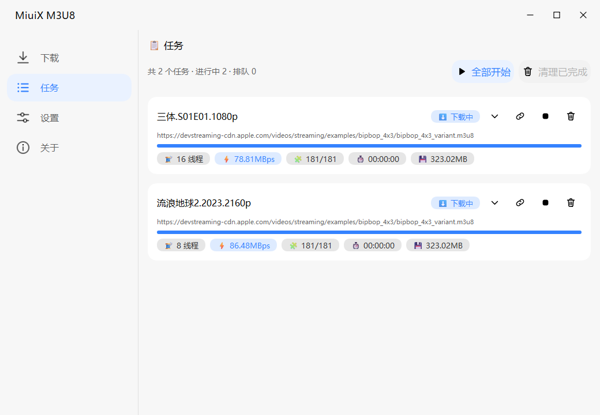
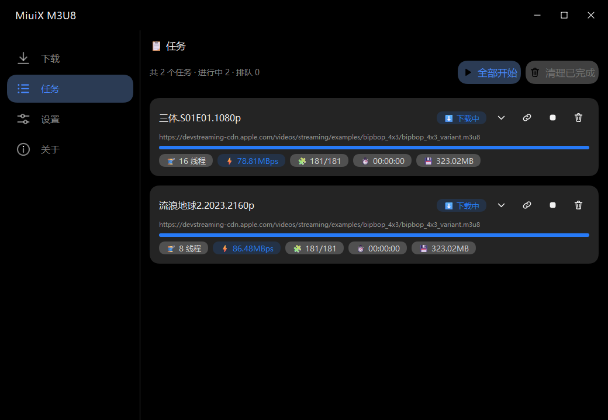
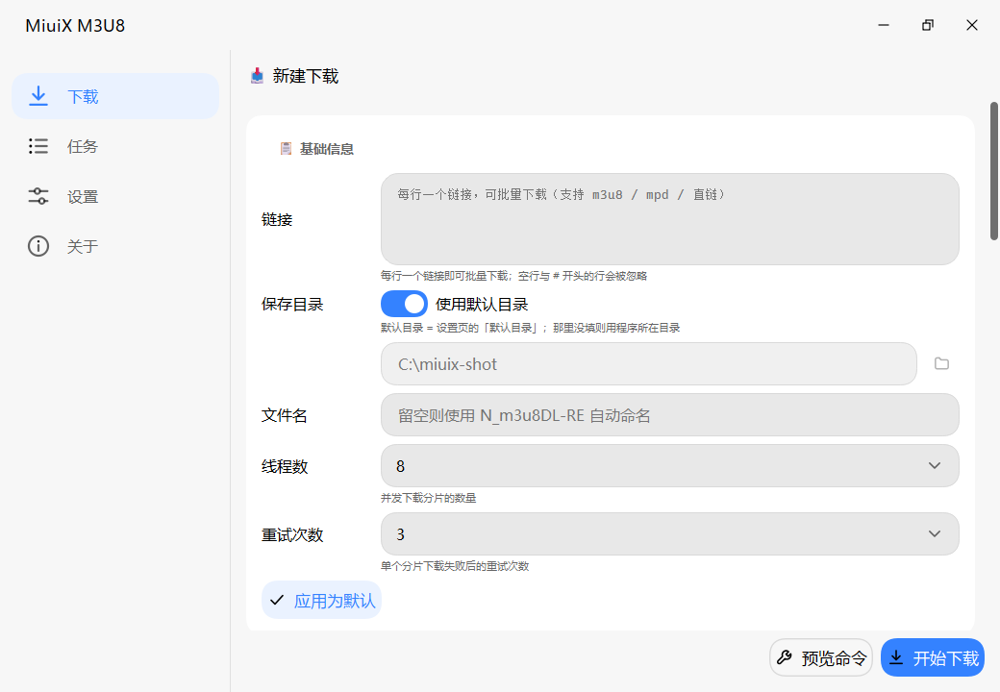
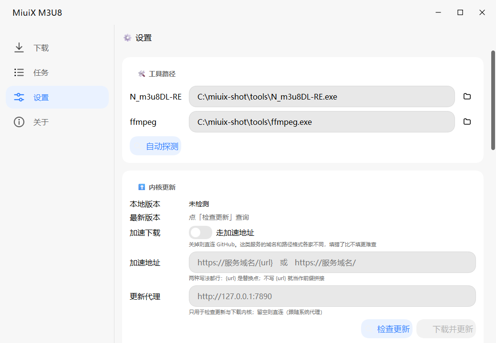
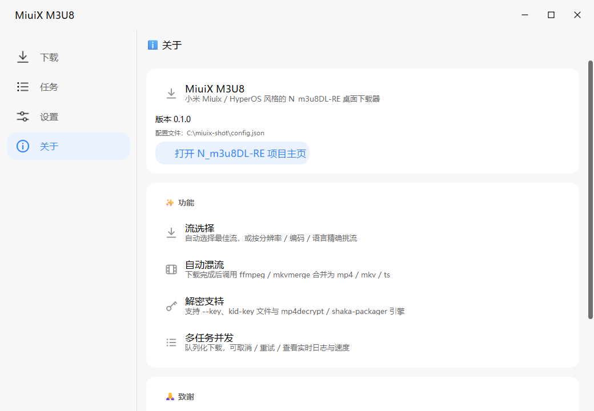
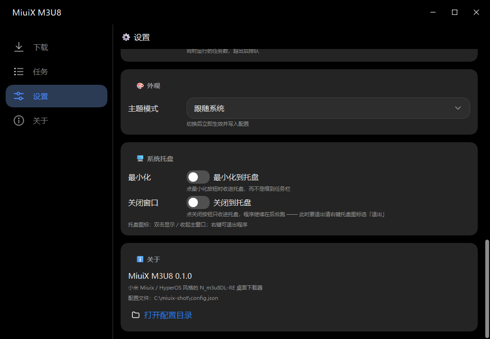
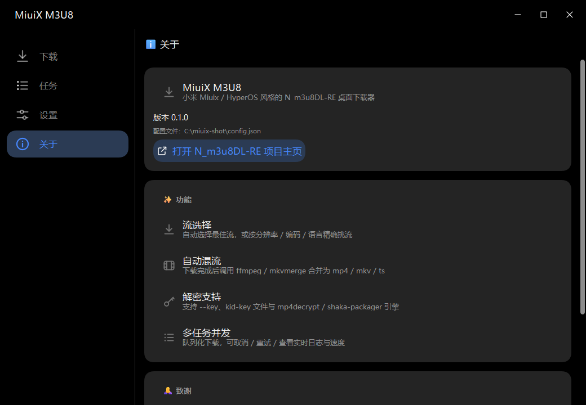
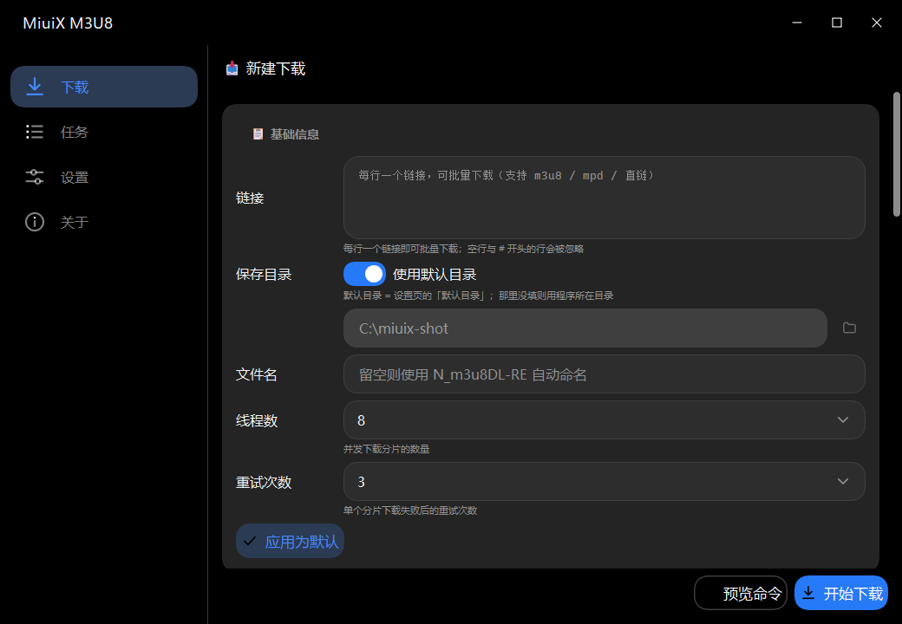
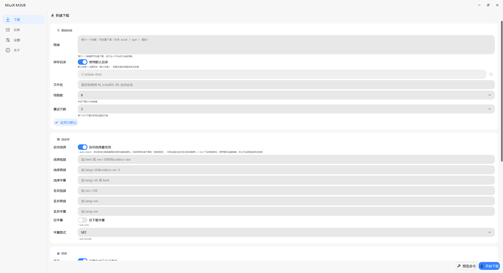

# MiuiX M3U8

为 [N_m3u8DL-RE](https://github.com/nilaoda/N_m3u8DL-RE) 打造的 **Windows 桌面下载器**，界面复刻小米 **Miuix / 澎湃 OS（HyperOS）** 设计语言。

技术选型、接口契约、Miuix 设计 token 的完整推导过程见 `docs/`。





---

## 快速开始（Windows）

1. 安装 **Python 3.11+**（安装时勾选 *Add Python to PATH*）
2. 双击 **`run.bat`** —— 首次运行会自动创建 `.venv` 并安装 PySide6，然后启动
3. 首次启动前，把外部工具放进 `tools\` 目录（或运行 **`tools\get-tools.bat`** 自动下载）：

   | 工具 | 必需性 | 说明 |
   |---|---|---|
   | `N_m3u8DL-RE.exe` | **必需** | 下载内核，已随仓库附带 v0.6.0-beta (win-x64) |
   | `ffmpeg.exe` | **必需** | RE 启动时会强制检查，缺失直接报错；已附带 |
   | `mp4decrypt.exe` | 可选 | 解密 DRM 流时需要（默认解密引擎） |
   | `shaka-packager.exe` | 可选 | 换用 SHAKA_PACKAGER 解密引擎时需要 |

   也可以在**设置页**手动指定路径，程序会自动探测 `tools\` 与 PATH。

## 打包成单文件 exe

```bat
build.bat
```

产物是**一个 exe**（PyInstaller `--onefile`，约 47 MB，自带 Python / PySide6 / Qt）：

```
dist\
├── MiuiX-M3U8.exe      ← 分发这个
└── tools\               ← 和 exe 必须同级
    ├── N_m3u8DL-RE.exe
    ├── ffmpeg.exe
    └── ffprobe.exe
```

**`ffmpeg` 与 `N_m3u8DL-RE` 刻意不打进 exe**：两者加起来 200 MB+，单文件模式下每次启动
都要把它们解压到临时目录，纯属浪费；而且解包路径每次都变，会把配置里记住的工具路径搞失效。
放在 exe 旁边的 `tools\` 里既快又稳（程序启动时会自动探测 exe 旁的 `tools\`）。

> 代价：单文件每次启动要把内容解到 `%TEMP%`，实测**到窗口出现约 4.5 s**；
> 旧的 onedir 模式只要 **1.4 s**。如果更在意启动速度，把 `--onefile` 去掉即可切回
> （产物变成 `dist\MiuiX-M3U8\` 整个目录）。

**配置也放在程序目录**（`MiuiX-M3U8.exe` 旁边的 `config.json`）—— 便携版该有的样子，
拷走整个目录就把设置一起带走了。目录只读时（装在 Program Files 之类）会自动回退到
`%APPDATA%\MiuiX-M3U8\`；从旧位置升级上来的第一次启动会自动读取老配置，不会丢设置。

---

## 功能

**下载**
- 兼容 m3u8 / MPD(DASH) / ISM 与直链，参数按 N_m3u8DL-RE v0.6.0-beta 完整暴露
- 基础：链接、保存目录、文件名、线程数、重试次数
- **「应用为默认」**：把当前这组参数立刻存成默认值 —— 浏览器扩展投递的任务以默认值为底，
  改了线程数不用再假装下一次单
- 流选择：自动选流 / `--select-video|audio|subtitle` / `--drop-*` / 仅字幕 / 字幕格式
- 混流：`-M` 的 format(mp4/mkv/ts) 与 muxer(ffmpeg/mkvmerge)
- 网络：系统代理、自定义代理、自定义请求头（Referer / Cookie / UA）、限速
- 解密：`--key` / `--key-text-file` / 自定义 HLS key、解密引擎与二进制路径
- **命令预览**：开始前可复制完整命令行，便于排查

**内核更新**
- 一键对比本地与 GitHub 最新版：跑 `N_m3u8DL-RE --version` 拿版本号 + commit，
  与 release tag、tag 指向的 commit 比对，能分辨「有新版本 / 同版本同构建 / 同版本不同构建」
- 下载 → 解包 → 原地替换（旧的自动留一份 `.bak`）；zip / tar.gz 都认，按平台自动挑资产
- **GitHub 加速地址**（带开关）：填 `https://服务域名/{url}` 或直接填前缀，下载走加速
- **更新专用代理**：只作用于检查更新与下载内核，不动下载任务的代理设置

**任务**
- 并发队列（并发数可配）、实时进度
- 每个任务用胶囊显示**线程数 / 速度 / 分段 / 剩余时间 / 大小**，与状态徽标同一套视觉语言
  （线程数取该任务自己的值 —— 扩展可以单独指定，跟桌面端默认不一定相同）
- 状态机：排队中 → 下载中 → 混流中 → 已完成 / 失败 / 已取消
- 取消（连根杀进程树）、重试、删除、打开所在文件夹、复制链接、展开原始日志

**界面**
- Miuix / HyperOS 设计语言：squircle 平滑圆角、卡片分组、官方颜色 token、14 档文本样式
- **沉浸式标题栏**：没有系统边框，标题栏与界面浑然一体（52px、随主题、关闭按钮悬停变红）。
  同时完整保留 Windows 原生行为 —— 单击拖动与 Aero Snap、双击最大化、边缘拉边缩放、
  最大化精确对齐工作区（不盖任务栏）、Win11 系统圆角
- 浅色 / 深色 / 跟随系统，切换即时生效（所有自绘控件重绘）
- **系统托盘**：可在设置里开启「最小化到托盘」「关闭到托盘」（默认都关）。
  托盘图标双击显示 / 收起主窗口，右键菜单可退出；窗口菜单样式跟随主题

**浏览器扩展**（独立项目，见下方「项目结构」）
- 嗅探网页里的 m3u8 / mpd，手动选中一条后连同 Referer / Cookie / UA 交给桌面端建任务
- 可在扩展设置里**单独指定这一批任务的下载线程数**（不指定则沿用桌面端默认）
- 也可一键复制 `N_m3u8DL-RE` 命令行，不经过 GUI
- 两种界面：点扩展图标弹面板 / 页面右下角常驻悬浮球（拖动靠边吸附）
- 本地接收端默认**关闭**，在「设置 → 浏览器扩展」里开启并设置端口与访问令牌



---

## 界面一览

浅色：

| ⚙️ 设置 | ℹ️ 关于 |
|---|---|
|  |  |

深色（同一套界面，切换即时生效）：

| ⚙️ 设置 | ℹ️ 关于 |
|---|---|
|  |  |

| 📥 新建下载（深色） | 最大化（沉浸式标题栏精确对齐工作区，不盖任务栏） |
|---|---|
|  |  |

---

## 项目结构

```
MiuiX-M3U8/
├── app/
│   ├── main.py            入口（init_theme → Config.load → TaskRunner → MainWindow）
│   ├── miuix/             Miuix 设计系统（自研，不依赖 miuix kotlin 库）
│   │   ├── tokens.py      颜色/字号/圆角/间距 token（数值取自 miuix 源码）
│   │   ├── theme.py       ThemeManager + QSS 生成 + 字体回退
│   │   ├── squircle.py    超椭圆平滑圆角路径（tile=r×1.1, handle=tile×0.357）
│   │   ├── widgets.py     21 个组件（Switch/Slider/ProgressBar 等自绘）
│   │   └── icons.py       38 个内联 SVG 图标，HiDPI + 主题取色
│   ├── core/              核心引擎（纯逻辑，不 import QtWidgets）
│   │   ├── model.py       DownloadOptions / DownloadTask / TaskStatus
│   │   ├── nm3u8dl.py     参数 → 命令行（只写非默认值）
│   │   ├── parser.py      stdout → 进度事件（剥 ANSI、按 \r 分帧）
│   │   ├── runner.py      subprocess + 读线程 + Qt 信号调度
│   │   └── config.py      配置持久化 + 依赖探测
│   └── ui/
│       ├── titlebar.py    沉浸式标题栏（窗口按钮全部 QPainter 自绘）
│       ├── window.py      无边框主窗口 + Windows 原生窗口行为（拉边 / Snap / 最大化）
│       └── pages/         下载 / 任务 / 设置 / 关于
├── tools/                 外部可执行文件
├── tests/                 核心自检（32 用例 / 343 断言）
├── docs/                  接口契约、Miuix token、CLI 参考、实测样例、图标
├── run.bat / build.bat    Windows 运行 / 打包
└── requirements.txt
```

浏览器扩展是**另一个仓库**，独立维护：[**MiuiX-M3U8-Extension**](https://github.com/ModChino/MiuiX-M3U8-Extension)

MV3 + 原生 JS，零依赖零构建。两者代码零耦合，只通过 `http://127.0.0.1:<port>` 的
`GET /ping` 与 `POST /add` 通信。打包时扩展会被复制一份进 exe
（`--add-data "extension;extension"`），所以改完扩展要重新同步 + 重新打包才会进安装包。

---

## 开发

```bash
uv venv --python 3.12 .venv
uv pip install --python .venv/bin/python pyside6

# 跑核心自检（含真实下载的端到端用例）
.venv/bin/python -m tests.test_core
MIUIX_M3U8_E2E=1 .venv/bin/python -m tests.test_core

# 离屏渲染，无需显示器
QT_QPA_PLATFORM=offscreen .venv/bin/python -m app.main
```

### 为什么不用 Tauri / Electron

重活全在 N_m3u8DL-RE 子进程里，Web 层拿不到性能优势，却要背上 WebView2 —— 而 WebView2 的**黑屏 / 白屏**正是要规避的问题。Qt6 是原生 C++ 渲染，Windows 上最稳，且同一份代码可离屏渲染截图做自动化验证。

（另有一个更"正宗"的选项：直接用 Compose Multiplatform + 官方 miuix 库。没选它是因为要拖进 JDK + Gradle + Kotlin 全套工具链、JVM 冷启动 1–2s 且常驻内存 300MB+，而本项目 UI 只是表单 + 列表 + 日志，收益不抵成本。视觉复刻改用源码级 token + squircle 自绘实现，见 `docs/MIUIX_TOKENS.md`。）

---

## 致谢

- [N_m3u8DL-RE](https://github.com/nilaoda/N_m3u8DL-RE) —— 下载内核
- [Miuix](https://github.com/compose-miuix-ui/miuix) —— 设计语言与 token 来源
- [Fluent-M3U8](https://github.com/zhiyiYo/Fluent-M3U8) —— 功能与交互参考
- [QFluentWidgets](https://qfluentwidgets.com/) —— 同类 Qt 组件库的实现思路参考

## 许可

本项目为 GUI 外壳。N_m3u8DL-RE 与 ffmpeg 遵循各自许可证，分发时请一并遵守。
